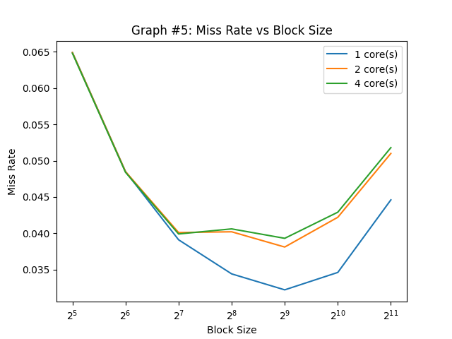

# Cache Simulator

Extensive cache simulator which allows users to run various performance experiments
by simulating cache accesses across different cache parameters (ex. capacity, block size, associativity).
Also supports multicore, the VI and MSI cache coherence protocols, and writebacks. For more usage
information, run `./p5 -help`. To create a cache trace for the simulator, use the format
`<core number> <r OR w> <memory address>`. As the simulation runs, detailed stats like
cache hit %, # of upgrade misses, total writeback traffic, and # of bus snoops are recorded.
Running the scripts in the `experiments` folder allows creation of graphs which allow users
to see how changing cache parameters affect the cache's performance (ex. miss rate vs block size for different multicore setups).

